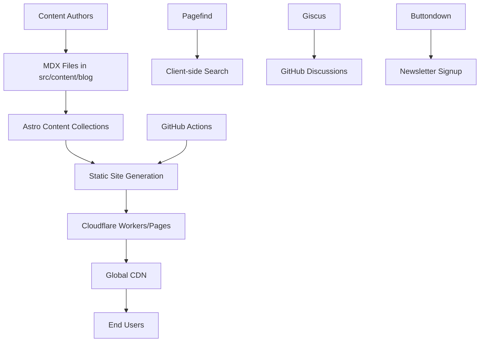

# Design Document

## Overview

AI Weekly by Poom is architected as a modern, performance-first blog using Astro's static site generation with optional SSR capabilities. The system leverages Astro's Content Collections for type-safe content management, Tailwind CSS for styling, and Cloudflare's edge infrastructure for global performance. The design emphasizes minimal complexity while delivering premium user experience through careful component architecture and progressive enhancement.

## Architecture

### High-Level Architecture



### Technology Stack

- **Framework**: Astro (latest) with hybrid rendering (static + SSR)
- **Content**: Content Collections with Zod schema validation
- **Styling**: Tailwind CSS with CSS custom properties for theming
- **Search**: Pagefind for static search indexing
- **Comments**: Giscus integrated with GitHub Discussions
- **Analytics**: Cloudflare Web Analytics (privacy-focused)
- **Deployment**: Cloudflare Workers (primary) + Pages (fallback)
- **CI/CD**: GitHub Actions with automated deployment

### Rendering Strategy

- **Static Generation**: Blog posts, tag pages, about page
- **Server-Side Rendering**: Dynamic OG image generation, search API endpoints
- **Client-Side**: Theme toggle, search interface, comment loading

## Components and Interfaces

### Core Layout Components

#### SiteHeader

```typescript
interface SiteHeaderProps {
  currentPath: string;
  showSearch?: boolean;
}
```

- Sticky navigation with logo, main nav links, theme toggle, and search trigger
- Responsive design with mobile hamburger menu
- Search keyboard shortcut (/) integration

#### SiteFooter

```typescript
interface SiteFooterProps {
  showNewsletter?: boolean;
}
```

- Newsletter signup form, social links, copyright
- Minimal design with consistent spacing

#### ThemeToggle

```typescript
interface ThemeToggleProps {
  initialTheme: "light" | "dark" | "system";
}
```

- Persistent theme selection with localStorage
- Smooth transitions between themes
- System preference detection

### Content Components

#### PostCard

```typescript
interface PostCardProps {
  post: {
    slug: string;
    data: {
      title: string;
      description: string;
      pubDate: Date;
      tags: string[];
      heroImage?: string;
    };
  };
  featured?: boolean;
}
```

- Responsive card layout with hover effects
- Tag pills, reading time, publication date
- Hero image with proper aspect ratios

#### PostMeta

```typescript
interface PostMetaProps {
  pubDate: Date;
  updatedDate?: Date;
  readingTime: number;
  tags: string[];
  author: Author;
}
```

- Publication and update dates
- Reading time estimation
- Author information and avatar

#### Prose

```typescript
interface ProseProps {
  content: string;
  className?: string;
}
```

- Typography-optimized content wrapper
- Code syntax highlighting with copy buttons
- Responsive image handling

### Interactive Components

#### SearchDrawer

```typescript
interface SearchDrawerProps {
  isOpen: boolean;
  onClose: () => void;
}
```

- Modal overlay with Pagefind integration
- Keyboard navigation (Arrow keys, Enter, Escape)
- Real-time search results with highlighting

#### TableOfContents

```typescript
interface TocProps {
  headings: Array<{
    depth: number;
    slug: string;
    text: string;
  }>;
  activeId?: string;
}
```

- Auto-generated from MDX headings
- Smooth scroll navigation
- Active section highlighting

#### Callout

```typescript
interface CalloutProps {
  type: "info" | "warning" | "tip" | "danger";
  title?: string;
  children: React.ReactNode;
}
```

- Styled content blocks for emphasis
- Icon integration with semantic colors
- Accessible markup with proper ARIA labels

## Data Models

### Content Collection Schema

```typescript
// src/content/config.ts
import { defineCollection, z } from "astro:content";

const blogCollection = defineCollection({
  type: "content",
  schema: z.object({
    title: z.string(),
    description: z.string(),
    pubDate: z.date(),
    updatedDate: z.date().optional(),
    tags: z.array(z.string()),
    heroImage: z.string().optional(),
    canonicalURL: z.string().url().optional(),
    draft: z.boolean().default(false),
    toc: z.boolean().default(true),
    author: z.string().default("Poom"),
    featured: z.boolean().default(false),
  }),
});

export const collections = {
  blog: blogCollection,
};
```

### Author Data Model

```typescript
// src/data/author.json
interface Author {
  name: string;
  bio: string;
  avatar: string;
  social: {
    twitter?: string;
    github?: string;
    email?: string;
    linkedin?: string;
  };
}
```

### Site Configuration

```typescript
// src/config.ts
interface SiteConfig {
  title: string;
  description: string;
  url: string;
  author: Author;
  postsPerPage: number;
  social: {
    twitter: string;
    github: string;
  };
  analytics: {
    cloudflare?: string;
  };
  newsletter: {
    provider: "buttondown" | "mailchimp";
    actionUrl: string;
  };
  comments: {
    giscus: {
      repo: string;
      repoId: string;
      category: string;
      categoryId: string;
    };
  };
}
```

## Error Handling

### Content Validation

- Zod schema validation for all frontmatter
- Build-time errors for invalid content
- Graceful fallbacks for missing optional fields

### Runtime Error Boundaries

- 404 pages for missing content
- Fallback UI for failed component loads
- Error logging to Cloudflare Analytics

### Build-Time Checks

- Link validation for internal references
- Image optimization and format validation
- RSS feed validation

## Testing Strategy

### Unit Testing

- Component rendering tests with Vitest
- Utility function tests (date formatting, reading time)
- Content schema validation tests

### Integration Testing

- Page rendering tests with Playwright
- Search functionality end-to-end tests
- Comment system integration tests

### Performance Testing

- Lighthouse CI integration
- Bundle size monitoring
- Core Web Vitals tracking

### Accessibility Testing

- Automated a11y testing with axe-core
- Keyboard navigation testing
- Screen reader compatibility testing

## Styling Architecture

### Design System Tokens

```css
/* CSS Custom Properties */
:root {
  /* Colors */
  --color-primary: #7c5cff;
  --color-primary-dark: #6b46ff;
  --color-text: #1f2937;
  --color-text-muted: #6b7280;
  --color-bg: #ffffff;
  --color-bg-secondary: #f9fafb;

  /* Typography */
  --font-sans: "Inter", system-ui, sans-serif;
  --font-mono: "JetBrains Mono", monospace;

  /* Spacing */
  --space-xs: 0.25rem;
  --space-sm: 0.5rem;
  --space-md: 1rem;
  --space-lg: 1.5rem;
  --space-xl: 2rem;
  --space-2xl: 3rem;

  /* Shadows */
  --shadow-sm: 0 1px 2px 0 rgb(0 0 0 / 0.05);
  --shadow-md: 0 4px 6px -1px rgb(0 0 0 / 0.1);
  --shadow-lg: 0 10px 15px -3px rgb(0 0 0 / 0.1);
}

[data-theme="dark"] {
  --color-text: #f9fafb;
  --color-text-muted: #d1d5db;
  --color-bg: #111827;
  --color-bg-secondary: #1f2937;
}
```

### Component Styling Patterns

- Utility-first approach with Tailwind CSS
- Component-specific CSS modules for complex styling
- Consistent spacing scale and typography rhythm
- Smooth transitions and hover states

## Performance Optimizations

### Image Optimization

- Astro's built-in image optimization
- WebP/AVIF format generation
- Responsive image sizing
- Lazy loading with intersection observer

### Code Splitting

- Route-based code splitting
- Dynamic imports for heavy components
- Minimal JavaScript bundles

### Caching Strategy

- Static asset caching with long TTL
- CDN edge caching for global performance
- Service worker for offline functionality (optional)

### Bundle Optimization

- Tree shaking for unused code
- CSS purging with Tailwind
- Font subsetting for used characters
- Critical CSS inlining

## SEO and Social Features

### Meta Tag Generation

- Dynamic title and description generation
- Open Graph image generation with @astrojs/og
- Twitter Card optimization
- Canonical URL management

### Structured Data

- BlogPosting schema for articles
- Organization schema for site identity
- Breadcrumb navigation schema

### Social Sharing

- Pre-configured share buttons
- Social media meta tags
- RSS feed with full content

This design provides a solid foundation for building a premium AI blog that meets all performance, accessibility, and user experience requirements while maintaining developer-friendly architecture and clear separation of concerns.
